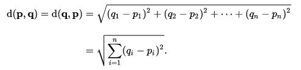

# Introduction

When data becomes high-dimensional, the inherent relational structure between the variables can sometimes become unclear or indistinct. One, might want to find clusters for numerous amounts of reasons - me, I want to use it to better understand my childhood. To be more specific, I will be using clustering to highlight different groupings of pokemon. The results of this analysis can then retrospectively be applied to a younger me having to choose which pokemon I catch and keep, or perhaps which I must rather use in battle to gain experience points. The clusters should help me identify groupings of pokemons that assimilate with my style of play, be it catching pokemon who are *specialist* of their type, *strong attackers*, *survivalist* who have good defensive capabilities or pokemon who have the potential to become great as soon as they evolve. 

This train of thought (aka hypothesis) will carry through to the analysis when number of cluster and inference needs to be conducted.

# About clustering techniques

Within the CRM field, a common practice is to segment client data in order to identify certain clusters of customers, users or products. The first question that I asked myself when I first encountered this technique was: "How usefull can this really be when there is no quantitative measure which dictates the number of clusters". The answer to this question became quite clear to me when I encountered a dataset of 8000 variables. 

Clustering lies within the field of data-reduction, and has the intention to uncover cohesive subgroups of observations within a very large dataset where inference aren't always clear from face value - i.e an Excel pivot table isn't going to cut it. Clustering is not only used within marketing, but is applied in biology, behavioural sciences, economics and medical research. The application of cluster analysis in the medical sciences interest me, as they use this technique to help catalog gene-expression patters which were obtained from DNA microarray data. Very cool application of this statistical technique. Without clustering, this task would become almost impossible due to the large amount of information. 

Clustering can primarily be divided up in two techniques: 

* Hierarchical Agglomerative methods
* Partitioning clustering

Hierarchical agglomerative clustering works from a bottom up approach where at the beginning, each observation is in its own cluster. From this clusters are combined into larger clusters, 2 at a time, until all the cluster have essentially been merged into one big cluster. With partitioning, one will specify **K** cluster which are sought after. Then the algorithm will essentially start by picking randomly dividing observations into clusters, assessing similarity, reshuffle, asses again and keep doing this until cohesive clusters are formed.

There is a lot of different techniques, but for the rest of this exploration into the topic, I will be using hierarchical agglomerative clustering (hclust) as my choice of clustering algorithm.

Now, the question is: "How are the observations linked to form these clusters?". In hclust the most popular techniques are:

* Single linkage: Shortest distance between a point in one cluster and a point in the other cluster.
* Complete linkage: Longest distance between a point in one cluster and a point in the other cluster.
* Average linkage: Average distance between each point in one cluster and each point in the other
cluster (also called UPGMA [unweighted pair group mean averaging])
* Centroid: Distance between the centroids (vector of variable means) of the two clusters.
For a single observation, the centroid is the variable's values.
* Ward's Method: The ANOVA sum of squares between the two clusters added up over all the
variables.

You are probably asking - what distance are you talking about here? We will use the `dist()` function in R to calculate the euclidean distance: 



where **q** and **p** are the observations and **N** is the number of variables. Easy enough right? I will be using *ward*'s method to cluster my objects as it is the default setting for *Hierarchical agglomerative clustering* for the `HCPC` function in `library(FactoMineR)`

# Lets go catch our pokemon
To collect the data on all the first generation pokemon, I employ Hadley Wickam's [rvest](https://cran.r-project.org/web/packages/rvest/index.html) package. I find it very intuitive and can handle all of my needs in collecting and extracting the data from a pokemon [wiki](http://bulbapedia.bulbagarden.net/wiki/Main_Page). I will grab all the Pokemon up until to Gen II, which constitutes 251 individuals.

```{r,include = FALSE}
options(warn = -1)
library(knitr)
library(pander)
setwd("/t-drive/Internal/Stats_team/Blog")
panderOptions('digits', 2)
panderOptions('round', 2)
panderOptions('table.style', 'rmarkdown')
```

The cleaned data looks as follows:
```{r, echo=T}
library(ggplot2)
library(FactoMineR)
all_pokemon <- read.csv("_rmd/Post_data/All_pokemon.csv",stringsAsFactors = F)
cat("Dimensions for pokemon data is :",dim(all_pokemon))
head(all_pokemon)
```

For those of you who know pokemon well, will also know that certain pokemon have only one evolution stage. We remove them in order to not intervere with our clustering at a later stage.

```{r}
Evo_none <- all_pokemon[which(all_pokemon$Evolves.From == "--" & all_pokemon$Evolves.Into=="--"), ]
```

The following pokemon were removed from the dataset: `r paste(Evo_none[,2],collapse=", ")`

The next step was to aggregate all the stage 2 statistics for the stage 1 evolution pokemon. This results in a nice wide dataset of variables we are able to use in our clustering. I am hoping to extract some sense of strenghts in pokemon, not only by their stage 1 statistics, but also perhaps their potential to become awesome assets later. One hopeful example of this would be everyone's favourite: magikarp.

```{r}
Evo_1 <- all_pokemon[which(all_pokemon$Evolves.From=="--" & all_pokemon$Evolves.Into!="--"), ]
Evo_2 <- all_pokemon[which(all_pokemon$Evolves.From!="--"), ]
##### Housekeeping - organise data into cluster format #####
Matched_pokemon <- merge(Evo_1,
                         Evo_2[,!names(Evo_2) %in% c('Evolves.Into')], 
                         by.x = "Evolves.Into",
                         by.y = "Pokemon",
                         all.x = T,
                         suffixes = c(".lv1",".lv2"))

#Create level of evolution variable 
Matched_pokemon$lvl_up.lv1 <- as.integer(gsub("[^0-9]+","", Matched_pokemon$lvl_up.lv1))

#Finalize complete set of pokemon
Matched_pokemon <- Matched_pokemon[complete.cases(Matched_pokemon), ]
pokemon <- Matched_pokemon$Pokemon

#Correct for Nidoran
pokemon[grep("Nido",pokemon)] <- c("Nidoran(F)","Nidoran(M)")

selected_var<-c("HP.lv1","HP.lv2",
                "Atk.lv1","Atk.lv2",
                "Def.lv1","Def.lv2",
                "SA.lv1","SA.lv2",
                "SD.lv1","SD.lv2",
                "Spd.lv1","Spd.lv2",
                "Total.lv1","Total.lv2",
                "Type.I.lv1","lvl_up.lv1")

Matched_pokemon <- Matched_pokemon[ ,names(Matched_pokemon)%in%selected_var]
row.names(Matched_pokemon) <- pokemon
```

The data has been constructed to look as follows before we continue our analysis:
```{r,echo=F,results='asis'}
pandoc.table(head(Matched_pokemon), format="rmarkdown", split.table=100)
```

For those curious to see the pokemon which ended up in our dataset. Here they are:
```{r,echo=F}
pokemon
```
One of the interesting variables that forms part of the data is the crucial question every trainer asks himself when catching pokemon - which types are the strongest? For each of my ~60 pokemon I use a boxplot to evaluate the relative strenght of a type. The data was normalized per level of evolution to ease plotting and interpretation.
```{r, dpi=200,fig.height=5,fig.width=8,fig.align="center"}
library(reshape2)
#http://www.color-hex.com/ - nice for color matching

# Transform from wide to long data
type <- melt(Matched_pokemon[,c(8,7,16)],id.vars = "Type.I.lv1")
type$Type.I.lv1 <- as.factor(type$Type.I.lv1)

#Normalize the data for cross comparison
type$norm <- do.call(c,tapply(type[,3],type[,2],function(x){(x-min(x))/(max(x)-min(x))}))

# Organise the data
l <- aggregate(type$norm,by=list(type$Type.I.lv1),mean)
type$Type.I.lv1 <- factor(type$Type.I.lv1,
                        levels = as.character(l[order(l[,2]),][,1]), 
                        ordered = TRUE)

#Plot
ggplot(aes(x = as.factor(Type.I.lv1), y = norm), 
      data = type) + 
      geom_boxplot(aes(fill =as.factor(variable) ))+
      theme_bw()+
      scale_x_discrete(name="Pokemon Type") +
      scale_y_continuous(name="Total Points (Normalised)")+
      scale_fill_manual(name="Evolution\nstage",
                         labels=c("1", "2"),
                         values=c("#0687EF", "#F04877"))
```
Good old bug pokemons don't catch a break, with the median total points being the lowest in both stages of evolution. For Normal, Poison and Water types, there seems to be a definite advantage to evolve in order to up the overall statistics. An interesting type to evaluate is the Fire type pokemon. In the first stage of evolution this type of pokemon seems to have an overall advantage, but once the pokemon starts evolving, the advantage dissipates.

One of the concerns I had was the class imbalance that might be present in the pokemon type. 
```{r,echo=F, dpi=200,fig.height=5,fig.width=10,fig.align="center"}
ggplot(as.data.frame(table(type$Type.I.lv1)), aes(x=Var1, y = Freq,fill=Var1)) +
  scale_x_discrete(name="Pokemon Type")+
  geom_bar(stat="identity",colour="darkgreen")+
  guides(fill=FALSE)+
  theme_bw()
```
The graph clearly points this out, so instead of adding the pokemon types into the analysis, they will be included as supplementary variable.

# Going Prof Elm and analysing pokemon
If you don't know who Prof Elm is, this [link](http://bulbapedia.bulbagarden.net/wiki/Professor_Elm) should help. To start our exploration into the pokemon dataset, we will conduct a *multiple factor analysis*. I find the flexibility of this function being able to conduct `MCA` and `PCA` in one go very helpful. It also has incredible plotting functions that helps to visually analyse your data.

```{r,dpi=200,fig.height=5,fig.width=10,fig.align="center"}
Matched_pokemon$Type.I.lv1 <- as.factor(Matched_pokemon$Type.I.lv1)

res <- MFA(Matched_pokemon,group = c(6,1,1,7,1),type=c(rep("s",2),"n",rep("s",2)),
           ncp=5,name.group = c("Lvl1","ToT1","Type","Lvl2","ToT2"),
           num.group.sup = c(2,3,5),graph = F)

plot(res,choix = "var", habillage = "group", cex=0.8, shadow = T)
```
Here we see that there is a definite inverse relationship between the speed of a Pokemon and its attack statistics. I find the relationship between special attack and normal attack interesting. It would seem that you either specialise or defualt to having a strong overall attack. 

The first thing to look at is the dispersion of the pokemon types to see how correlation all the pokemons are given their type.
```{r,echo=F,dpi=200,fig.height=5,fig.width=10,fig.align="center"}
plot(res,invisible = "ind")
```
It would seem that Ghost, Psyhic and Electric pokemon have different characteristics than those of Ground, Fighting and Bug for instance. 

Given these factor groups, next it would be interesting to see which of the pokemon had the highest contribution to the construction dimension (Contribution 10). I also want to see the highest quality of representation (cos2>0.6). The *cos^2*, indicates the contribution of a component to the squared distance of the observation to the origin. i.e *cos^2* is an important contributor to find the components that are important to interpret both active and supplementary observations, [Abdi H, 2010](https://www.utdallas.edu/~herve/abdi-awPCA2010.pdf).
```{r,echo=F,dpi=200,fig.height=9,fig.width=10,fig.align="center"}
par(mfrow=c(2,1))
plot(res,invisible = "quali",cex=0.8,select="cos2 0.6",title = "cos2 > 0.6")
plot(res,invisible = "quali",habillage = "Type.I.lv1",select = "contrib 10",palette = palette(rainbow(15)),title = "Contribution 10")
```

Now that we have a clearer understanding of the data, its finally time to conduct the exciting cluster analysis on the data. With the `MFA` function, this is easily done by plugging the results directly into a hierarchical clustering algorithm. I decided to cut the tree to get 4 clusters in the end. Felt that these represented the different facets of pokemon quite well.

```{r}
res.hcpc <- HCPC(res, nb.clust=4, consol=TRUE, iter.max=10, min=3,
                 max=NULL, metric="euclidean", method="ward", order=TRUE,
                 graph.scale="inertia", nb.par=5, graph=F, proba=0.05, 
                 cluster.CA="rows",kk=Inf)
```

Here we can see a 3D representation of the tree that was build. I also add the conventional tree:
```{r,echo=F,dpi=200,fig.height=6,fig.width=10,fig.align="center"}
plot(res.hcpc,palette=palette(rainbow(5)))
```

```{r}
plot(res.hcpc,draw.tree = T,choice = "tree")
```

I wanted to see the type dispersion among the clusters, perhaps hoping to see a coherent split of types among the clusters...
```{r,digits=2,echo=F}
x1 <- addmargins(table(res.hcpc$data.clust$Type.I.lv1,res.hcpc$data.clust$clust),margin = 1)
x2 <- round(prop.table(table(res.hcpc$data.clust$Type.I.lv1,res.hcpc$data.clust$clust),margin = 1),2)
```

```{r,echo=F,results='asis'}
pandoc.table(x1,format="rmarkdown")
```

And broken down proportionally:

```{r,echo=F,results='asis'}
pandoc.table(x2,format="rmarkdown")
```


Now comes the interesting bit, dissecting the data to see which pokemon clustered together and why they were thrown into the same cluster.
```{r,echo = F}
descr <- Map(cbind, res.hcpc$desc.var$quanti, list=names(res.hcpc$desc.var$quanti))
descr <- lapply(descr, function(x) data.frame(x[,c("v.test","Mean in category","Overall mean","p.value")]))
clust_dat <- res.hcpc$data.clust
```
## Cluster 1
Ok, so the pokemon that ended up in cluster 1 was: `r rownames(clust_dat[which(clust_dat$clust==1),])`. This is quite an odd bunch if you know pokemon well. So, what was it that made them cluster together?

```{r,echo=F,results='asis'}
pandoc.table(data.frame(Stat=row.names(descr[[1]]),sapply(descr[[1]],function(x) as.numeric(as.character(x)))),format="rmarkdown",round=2)
```

These Pokemon are specialist in special attacking moves. With the mean attack stat being almost 1/4 higher than the mean of all the other pokemon. These pokemon should be used when there is a type advantage!

## Cluster 2
Moving onto cluster 2: `r rownames(clust_dat[which(clust_dat$clust==2),])`.

```{r,echo=F,results='asis'}
pandoc.table(data.frame(Stat=row.names(descr[[2]]),sapply(descr[[2]],function(x) as.numeric(as.character(x)))),format="rmarkdown",round=2)
```

Although these pokemon have defensive capabilities, these capabilities are more pronounced than what we saw in cluster 1 where the individuals had a small significant advantage in a specialized situation.

## Cluster 3
This cluster was the biggest with 24 Pokemon ending up in this category. The pokemon that forms part of this cluster is: `r rownames(clust_dat[which(clust_dat$clust==3),])`.

```{r,echo=F,results='asis'}
pandoc.table(data.frame(Stat=row.names(descr[[3]]),sapply(descr[[3]],function(x) as.numeric(as.character(x)))),format="rmarkdown",round=2)
```

It would seem that these pokemon underscore on all statistics and should probably we avoided as strategic investments in your lineup.

## Cluster 4
The last group that was identified were Pokemon that are all-rounders. `r rownames(clust_dat[which(clust_dat$clust==4),])` - have overall statistics which are higher than average, but does not specialize in any of the type specific advantages that exist in the Pokemon games.
```{r,echo=F,results='asis'}
pandoc.table(data.frame(Stat=row.names(descr[[4]]),sapply(descr[[4]],function(x) as.numeric(as.character(x)))),format="rmarkdown",round=2)
```

## Paragons of the clusters
One of the nicest outputs of `HCPC` is the listed paragons per group. These paragons can be seen as the poster-child representative of each cluster:

Cluster 1:
```{r,echo=F,results='asis'}
pandoc.table(res.hcpc$desc.ind$para[[1]],format="markdown")
```

Cluster 2:
```{r,echo=F,results='asis'}
pandoc.table(res.hcpc$desc.ind$para[[2]],format="markdown")
```

Cluster 3:
```{r,echo=F,results='asis'}
pandoc.table(res.hcpc$desc.ind$para[[3]],format="markdown")
```

Cluster 4:
```{r,echo=F,results='asis'}
pandoc.table(res.hcpc$desc.ind$para[[4]],format="markdown")
```

The output of the `HCPC` also allows us to see the individuals which are the most distance from all the other cluster. For brevity, ill leave this table out of this post. These most distant individuals are usually outliers which end up in the group to which it relates (relatively) the closest.
```{r,echo=F}
options(warn=0)
```

#Conclusion
This post explored cluster analysis, or formally put, a tool in which a multivariate dataset can be explored and eventually be divided into subgroups of similar data based on some kind of proximity estimate. I used Pokemon data as I found it to be an interesting dataset to apply this kind of technique. I must say, that the `FactoMineR` library helps a lot in facilitating the clustering process once your dataset is in proper format. It takes you through a natural progression of  clustering application with a lot of flexibility available to the user to tune the analysis to his/hers needs. I especially like the `MFA` function where both `PCA` and `MCA` can be integrated into a concise function.

In terms of the results, I think it would be interesting to further delve into type combinations within the group in order to have the strongest Pokemon along with a type advantage. But we will leave this for another day...

Although most of the code is included in the post. The complete markdown can be found on our (github)[https://github.com/Eighty20/eighty20.github.io]. 

